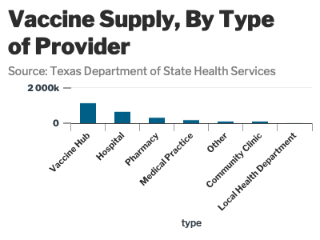

<!-- README.md is generated from README.Rmd. Please edit that file -->

# lbjdata

<!-- badges: start -->
<!-- badges: end -->

The goal of lbjdata is to …

## Installation

You can install the released version of lbjdata from
[CRAN](https://CRAN.R-project.org) with:

``` r
install.packages("lbjdata")
```

## Example

This is a basic example which shows you how to solve a common problem:

``` r
library(lbjdata)
library(tidyverse)
#> ── Attaching packages ─────────────────────────────────────── tidyverse 1.3.0 ──
#> ✓ ggplot2 3.3.3     ✓ purrr   0.3.4
#> ✓ tibble  3.0.6     ✓ dplyr   1.0.4
#> ✓ tidyr   1.1.2     ✓ stringr 1.4.0
#> ✓ readr   1.4.0     ✓ forcats 0.5.0
#> ── Conflicts ────────────────────────────────────────── tidyverse_conflicts() ──
#> x dplyr::filter() masks stats::filter()
#> x dplyr::lag()    masks stats::lag()
library(janitor)
#> 
#> Attaching package: 'janitor'
#> The following objects are masked from 'package:stats':
#> 
#>     chisq.test, fisher.test
library(highcharter)
#> Registered S3 method overwritten by 'quantmod':
#>   method            from
#>   as.zoo.data.frame zoo
```

What is special about using `README.Rmd` instead of just `README.md`?
You can include R chunks like so:

``` r
provider_types <- read_csv("https://genesis.soc.texas.gov/files/accessibility/vaccineprovideraccessibilitydata.csv") %>% 
  clean_names() %>% 
  group_by(type) %>% 
  summarise(tot_shipped = sum(total_shipped),
            tot_avail = sum(vaccines_available)) %>% 
  drop_na() %>% 
  arrange(desc(tot_shipped))
#> 
#> ── Column specification ────────────────────────────────────────────────────────
#> cols(
#>   NAME = col_character(),
#>   TYPE = col_character(),
#>   TSA = col_character(),
#>   STREET = col_character(),
#>   CITY = col_character(),
#>   COUNTY = col_character(),
#>   ADDRESS = col_character(),
#>   ZIP = col_character(),
#>   LAST_UPDATE_VAC = col_character(),
#>   LAST_UPDATE_TIME_VAC = col_time(format = ""),
#>   PFIZER_AVAILABLE = col_double(),
#>   MODERNA_AVAILABLE = col_double(),
#>   VACCINES_AVAILABLE = col_double(),
#>   Total_Shipped = col_double(),
#>   PublicPhone = col_character(),
#>   WEBSITE = col_character()
#> )

provider_types %>% 
  hchart("column", hcaes(x=type, y = tot_shipped, colors=type)) %>% 
  hc_add_theme(hc_theme_lbj()) %>% 
  hc_title(text="Vaccine Supply, By Type of Provider") %>% 
  hc_subtitle(text="Source: Texas Department of State Health Services")
```



You’ll still need to render `README.Rmd` regularly, to keep `README.md`
up-to-date. `devtools::build_readme()` is handy for this. You could also
use GitHub Actions to re-render `README.Rmd` every time you push. An
example workflow can be found here:
<https://github.com/r-lib/actions/tree/master/examples>.

You can also embed plots, for example:


In that case, don’t forget to commit and push the resulting figure
files, so they display on GitHub and CRAN.
