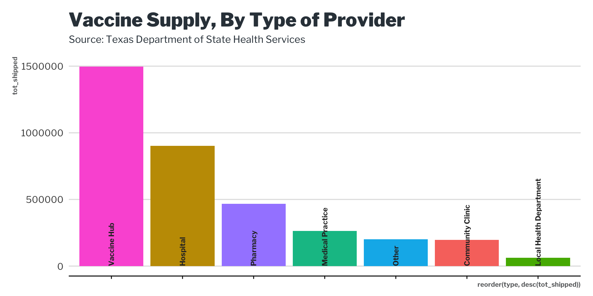

<!-- README.md is generated from README.Rmd. Please edit that file -->

# lbjdata

<!-- badges: start -->
<!-- badges: end -->

The goal of lbjdata is to …

## Installation

You can install the released version of lbjdata from
[CRAN](https://CRAN.R-project.org) with:

``` r
install.packages("lbjdata")
```

## Example

This is a basic example which shows you how to solve a common problem:

``` r
library(lbjdata)
library(ggplot2)
library(readr)
library(dplyr)
#> 
#> Attaching package: 'dplyr'
#> The following objects are masked from 'package:stats':
#> 
#>     filter, lag
#> The following objects are masked from 'package:base':
#> 
#>     intersect, setdiff, setequal, union
library(tidyr)
```

What is special about using `README.Rmd` instead of just `README.md`?
You can include R chunks like so:

``` r
provider_types <- read_csv("https://genesis.soc.texas.gov/files/accessibility/vaccineprovideraccessibilitydata.csv") %>% 
  group_by(type = TYPE) %>% 
  summarise(tot_shipped = sum(Total_Shipped),
            tot_avail = sum(VACCINES_AVAILABLE)) %>% 
  drop_na() %>% 
  arrange(desc(tot_shipped))
```

``` {
provider_types %>% 
  ggplot() +
  geom_col(aes(x=reorder(type, desc(tot_shipped)), 
               y = tot_shipped, 
               fill=type)) +
  geom_text(angle=90, color="#2d2d2d", size = 3.1, family = "LibreFranklin-Bold",
            aes(y= 0, x=type, label = type), hjust = 0) +
  theme_lbj() +
  theme(axis.text.x = element_blank()) +
  labs(title = "Vaccine Supply, By Type of Provider",
       subtitle = "Source: Texas Department of State Health Services")
```


